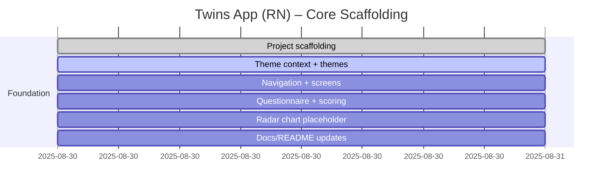

# Progress chart

# Development notes

- 2025-08-30: Initialized React Native (Expo-style) project structure with TypeScript, theming scaffold, navigation stack, core screens (Registration, Questionnaire, Results), question dataset (IPIP-50), and scoring utilities. RadarChart is a placeholder using `react-native-svg` API design, pending library install. Font assets (Inter) and ML model files are placeholders and should be added later. Auth integrations (Firebase/GCP) will be wired in future iterations.

- 2025-09-05: Questionnaire UX redesigned to one-question-at-a-time flow with horizontal Likert buttons. Added Prev/Next navigation, progress indicators, selection glow, and “Complete remaining” helper on the final step. Removed early-finish option; results are gated until all 50 items are answered. Updated product document to reflect the new flow and constraints.
- 2025-09-05: Added NotificationModal component for future notices. Adjusted questionnaire flow to gated navigation: "Next" is disabled until the current question is answered, and the final step shows "See result" only after answering the last item. Removed last-step modal/cycling logic accordingly. Tap-to-dismiss keyboard wrapper remains; haptics are minimal and completion-only.
- 2025-09-08: Added Create Account screen (mock). Prefills username/email/gender/age group, includes password + confirm with strength indicator and show/hide toggles, displays a mocked fingerprint derived from quiz scores (TODO: replace with TF Lite). Added social sign-in placeholders (Google/Facebook/Apple/Microsoft) with TODO for Firebase Auth integration. Kept NotificationModal for prototype messaging.
- 2025-09-08: Polished Create Account screen: added Terms/Privacy acknowledgment (required to submit), provider-colored social sign-in buttons with icons, password show/hide toggles, and clearer guidance text. Still mocked flows; to be integrated with Firebase Auth and TF Lite fingerprint.
- 2025-09-08: Onboarding update — added Login screen (mock) as initial route with email/password and a CTA to start the personality quiz. Questionnaire now has a visible header with a custom swipe-left-to-go-back gesture on the header. Results links to Create Account; Create Account includes a "Back to Login" button. Docs updated accordingly.
- 2025-09-08: UI polish — added visible back arrow to questionnaire header; improved keyboard dismissal to avoid blocking scroll and enabled ScrollView keyboardDismissMode. Social sign-in buttons use brand colors and icons.
- 2025-09-08: Form UX — implemented auto-advance across Login, Registration, and Create Account: Return/Enter focuses the next field; dropdown selections auto-open the next dropdown or move focus to the next input; final fields attempt action when valid.
- 2025-09-08: Supabase integration — added Supabase client and polyfills. Login screen attempts a lightweight connectivity check and, when successful, shows “Powered by Supabase” beside the welcome title.
 - 2025-09-08: Supabase config moved to Expo Constants: app.json extra now carries supabaseUrl and supabaseAnonKey, read via expo-constants. Fallback to EXPO_PUBLIC_ env vars supported.
