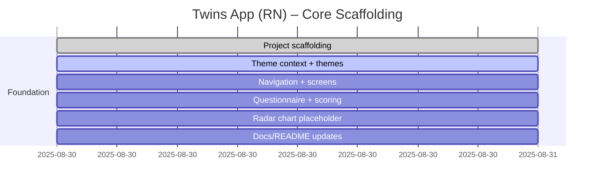

# Progress chart

# Development notes

- 2025-08-30: Initialized React Native (Expo-style) project structure with TypeScript, theming scaffold, navigation stack, core screens (Registration, Questionnaire, Results), question dataset (IPIP-50), and scoring utilities. RadarChart is a placeholder using `react-native-svg` API design, pending library install. Font assets (Inter) and ML model files are placeholders and should be added later. Auth integrations (Firebase/GCP) will be wired in future iterations.

- 2025-09-05: Questionnaire UX redesigned to one-question-at-a-time flow with horizontal Likert buttons. Added Prev/Next navigation, progress indicators, selection glow, and “Complete remaining” helper on the final step. Removed early-finish option; results are gated until all 50 items are answered. Updated product document to reflect the new flow and constraints.
 - 2025-09-05: Added NotificationModal component and integrated into the questionnaire. On reaching Q50 with remaining items, a guidance modal appears and the last-step button becomes "Go back" to cycle through unanswered questions; when complete, it changes to "See result". Implemented tap-to-dismiss keyboard wrapper globally and toned down haptics (Expo Haptics ready). Ensured "Start Over" resets navigation to clear prior answers.
