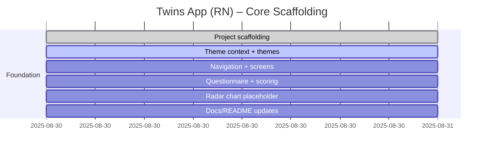

# Progress chart

# Development notes

- 2025-08-30: Initialized React Native (Expo-style) project structure with TypeScript, theming scaffold, navigation stack, core screens (Registration, Questionnaire, Results), question dataset (IPIP-50), and scoring utilities. RadarChart is a placeholder using `react-native-svg` API design, pending library install. Font assets (Inter) and ML model files are placeholders and should be added later. Auth integrations (Firebase/GCP) will be wired in future iterations.

- 2025-09-05: Questionnaire UX redesigned to one-question-at-a-time flow with horizontal Likert buttons. Added Prev/Next navigation, progress indicators, selection glow, and “Complete remaining” helper on the final step. Removed early-finish option; results are gated until all 50 items are answered. Updated product document to reflect the new flow and constraints.
- 2025-09-05: Added NotificationModal component for future notices. Adjusted questionnaire flow to gated navigation: "Next" is disabled until the current question is answered, and the final step shows "See result" only after answering the last item. Removed last-step modal/cycling logic accordingly. Tap-to-dismiss keyboard wrapper remains; haptics are minimal and completion-only.
- 2025-09-08: Added Create Account screen (mock). Prefills username/email/gender/age group, includes password + confirm with strength indicator and show/hide toggles, displays a mocked fingerprint derived from quiz scores (TODO: replace with TF Lite). Added social sign-in placeholders (Google/Facebook/Apple/Microsoft) with TODO for Firebase Auth integration. Kept NotificationModal for prototype messaging.
- 2025-09-08: Polished Create Account screen: added Terms/Privacy acknowledgment (required to submit), provider-colored social sign-in buttons with icons, password show/hide toggles, and clearer guidance text. Still mocked flows; to be integrated with Firebase Auth and TF Lite fingerprint.
- 2025-09-08: Onboarding update — added Login screen (mock) as initial route with email/password and a CTA to start the personality quiz. Questionnaire now has a visible header with a custom swipe-left-to-go-back gesture on the header. Results links to Create Account; Create Account includes a "Back to Login" button. Docs updated accordingly.
- 2025-09-08: UI polish — added visible back arrow to questionnaire header; improved keyboard dismissal to avoid blocking scroll and enabled ScrollView keyboardDismissMode. Social sign-in buttons use brand colors and icons.
- 2025-09-08: Form UX — implemented auto-advance across Login, Registration, and Create Account: Return/Enter focuses the next field; dropdown selections auto-open the next dropdown or move focus to the next input; final fields attempt action when valid.
- 2025-09-08: Supabase integration — added Supabase client and polyfills. Login screen attempts a lightweight connectivity check and, when successful, shows “Powered by Supabase” beside the welcome title.
- 2025-09-08: Supabase config moved to Expo Constants: app.json extra now carries supabaseUrl and supabaseAnonKey, read via expo-constants. Fallback to EXPO_PUBLIC_ env vars supported.
- 2025-09-08: Wired Login and Registration to Supabase: on Login or starting the Questionnaire, the app ensures a user record exists (insert if missing) based on email and optional username. Non-blocking; errors are suppressed in UI for now.
- 2025-09-08: Dashboard placeholder added. Login now upserts the user (email/username/password - prototype only) and authenticates against Supabase `public.User`. On success, navigates to Dashboard displaying a personalized welcome.
- 2025-09-08: Switched Login to Supabase Auth (email/password). After sign-in, app upserts a `User` profile row by email for prototype display. Added Logout on Dashboard. Documented DB migrations: unique email index, RLS policies, and recommended `profiles` table keyed by `auth.users.id`.
- 2025-09-08: Migrated app code to use `public.profiles` keyed by `auth.users.id` for profile data. Login fetches/creates the profile after Auth sign-in, and Create Account inserts the profile when session is present (otherwise prompts for email verification). Registration no longer pre-creates any DB rows.

- 2025-09-09: UI enhancement — added show/hide password toggle to Login screen, matching Create Account’s password visibility control. Keeps secure entry as default; accessible toggle with clear label.

- 2025-09-09: Theming — introduced unified `--bg` key and `--surface`/`--border` for inner components; Light theme now uses the purple (#A376A2 / 163 118 162) as `--bg`. Replaced hardcoded inner backgrounds with theme surfaces (Cards, inputs, dropdowns, questionnaire blocks). Navigation/background updated to `--bg`.

- 2025-09-09: Onboarding flow — reintroduced Registration as the step before the personality questionnaire. The Login CTA now routes to Registration (prefilling email if provided), which then routes to Questionnaire with username/email/age group/gender. Create Account continues to auto‑fill these details.

- 2025-09-09: Readability — standardized text colors across Login, Create Account, Dropdown, Questionnaire header, and NotificationModal. Added `--text-muted` for placeholders/hints; replaced hardcoded `#fff/#bbb/#888` with theme-driven `--text-primary/--text-secondary/--text-muted`. NotificationModal buttons and text now respect theme.

- 2025-09-09: Bug fix — scroll lock after background taps. Root cause: the global keyboard dismiss wrapper used a full-screen `Pressable` that captured touch/scroll gestures, preventing the underlying `ScrollView` from handling drags. Fix: replaced with `TouchableWithoutFeedback` wrapping a `View` (flex:1) so background taps dismiss the keyboard without intercepting pan/scroll gestures. Verified across Login/Registration/Create Account/Results.

- 2025-09-09: UX — added focused field highlight using a purple focus ring/shadow on all text inputs and dropdown triggers. Introduced `--focus` color to themes (A376A2) for consistent focus styling. Dropdown sheets now render a non-selectable header showing the placeholder (e.g., “Choose your age group/gender”).

- 2025-09-09: Navigation — added themed back headers (SwipeHeader) to Registration, Questionnaire, Results, and Create Account screens. Back arrow uses secondary text color; header surface blends with current theme. Swipe-to-go-back gesture still supported.

- 2025-09-09: Theming — added a Light theme preset to `themes/index.ts` (readable text and card colors) and a theme switcher on the Dashboard to toggle Dark/Light at runtime. Navigation theme now reflects the current selection.
- 2025-09-09: Branding — updated Expo `splash.backgroundColor` to `#A376A2` to match the new default background preset.
- 2025-09-08: Cleanup — removed legacy `public.User` code paths (ensureUser/upsertUser/authenticateUser). Switched Supabase connectivity probe on Login to an Auth endpoint (`getSession`).
- 2025-09-30: Internationalization pass — introduced `LocaleProvider` + translation dictionaries, localized Login/Registration/Create Account/Questionnaire/Results/Character/Verify Email screens, externalized questionnaire copy to `data/questionTexts.ts`, added localized dropdown options and notices, and documented the flow in the new i18n guide. Updated results handoff to use the actual username supplied during onboarding.
- 2025-10-21: Added `Documents/file-map.md` as a repository lookup map and updated coding conventions to reference it; future structural changes should adjust the map alongside the implementation.
- 2025-10-02: Onboarding guidance — added a two-step splash-style flow ahead of registration and the questionnaire. The Login CTA now opens a branded Pre-Quiz Intro with profile expectations; completing registration routes through a Quiz Primer carousel that explains the 5-point Likert scale with the app’s preset colors before launching the questionnaire. Navigation stack, theming, and i18n updated accordingly.
- 2025-11-01: Refined Big Five scoring to match the PCA notebook: questionnaire results now propagate as 0-1 floats, UI converts to percent for display, archetype and fingerprint math convert internally, and a `yarn verify:scores` script cross-checks against notebook fixtures.
- 2025-10-28: Auth UX — Login now detects the Supabase “Email not confirmed” response and surfaces a verification CTA that routes back into the OTP screen with stored signup details plus a clear reminder to finish confirmation. The Verify Email screen inherits the leave-confirmation modal (header/back/system exit), shows a success notice for post-verification routing, and Create Account now pre-checks `public.users` for duplicate emails/usernames so conflicts surface before the OTP step.
