# Progress chart

```mermaid
gantt
    title Twins App (RN) – Core Scaffolding
    dateFormat  YYYY-MM-DD
    section Foundation
    Project scaffolding           :done,   a1, 2025-08-30, 1d
    Theme context + themes        :active, a2, 2025-08-30, 1d
    Navigation + screens          :        a3, 2025-08-30, 1d
    Questionnaire + scoring       :        a4, 2025-08-30, 1d
    Radar chart placeholder       :        a5, 2025-08-30, 1d
    Docs/README updates           :        a6, 2025-08-30, 1d
```

# Development notes

- 2025-08-30: Initialized React Native (Expo-style) project structure with TypeScript, theming scaffold, navigation stack, core screens (Registration, Questionnaire, Results), question dataset (IPIP-50), and scoring utilities. RadarChart is a placeholder using `react-native-svg` API design, pending library install. Font assets (Inter) and ML model files are placeholders and should be added later. Auth integrations (Firebase/GCP) will be wired in future iterations.
