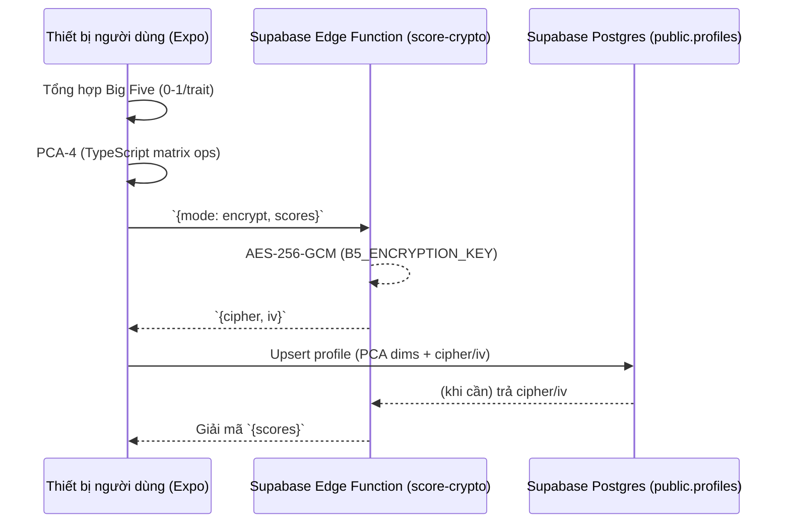

# Slide 1 – Bìa
- Tiêu đề: “Twins – Bảo vệ dữ liệu tính cách người dùng trên di động”
- Thông tin nhóm + thời gian
- Hình minh hoạ: màn hình Login và Dashboard đặt cạnh nhau
> Ghi chú: nhấn mạnh Twins là luận văn liên ngành (UX + dữ liệu + bảo mật).

# Slide 2 – Giới thiệu đồ án
- Twins giúp người dùng khám phá tính cách, lưu trữ an toàn cho hệ thống gợi ý.
- Mục tiêu: giữ trọn vẹn dữ liệu nhưng vẫn riêng tư qua 3 bước: **Aggrigate → Encode → Encrypt/Decrypt**.
- Nêu stack: Expo React Native + Supabase (Auth, DB, Edge Function).
> Giải thích miệng: tóm tắt quy trình Resume Flow và lý do cần bảo vệ dữ liệu cảm tính.

# Slide 3 – Cơ sở & phương pháp đề xuất
- Vì sao phải bảo vệ dữ liệu Big Five: chứa nét tính cách khó thay đổi.
- Vì sao Big Five: bộ đánh giá phổ biến, dữ liệu/công thức chuẩn (OpenPsychometrics).
- Vì sao PCA-4: thử nghiệm trong `model/pca_evaluator.ipynb` cho thấy PCA-3/2 mất ~20‑30% phương sai ⇒ PCA-4 giữ ~92% thông tin gốc.
- Vì sao AES-256-GCM: chuẩn công nghiệp, chống giả mạo (GCM) và dễ tích hợp Supabase Edge; so với RSA/Bcrypt thì hiệu quả hơn cho payload nhỏ.
- **Tech stack liên quan**:
  - Expo RN + TypeScript (chạy trên iOS Simulator/Android Emulator) thực hiện aggregate/PCA local.
  - `services/pcaEvaluator.ts` dùng phép nhân ma trận thuần TS (chạy trong Metro bundler môi trường Expo 54/React 19).
  - Supabase Edge Function chạy trên Deno runtimes (v1.69), sử dụng Web Crypto API AES-GCM.
  - Supabase CLI 2.x để deploy và quản lý secrets (`B5_ENCRYPTION_KEY`).
> Ghi chú: nêu con số phương sai và đề cập không chọn Differential Privacy vì cần độ chính xác cao cho gợi ý.

# Slide 4 – Sơ đồ trình tự (Actors & Data)

- Ghi rõ trường DB: `pca_dim1..4`, `b5_cipher`, `b5_iv`.
> Ghi chú: nhấn mạnh khóa AES chỉ ở Edge, thiết bị không lưu.

# Slide 5 – Thu thập dữ liệu
- Nội dung câu hỏi: 125 câu tổng hợp từ OpenPsychometrics + các bộ bổ sung (Documented trong `Documents/Twins - Documents.md`).
- Dataset phản hồi: nguồn tham chiếu quốc tế (OpenPsychometrics releases); lưu cục bộ để EDA/PCA.
- Điểm số: Likert 5 mức ⇒ chuẩn hóa 0‑1 và tính Big Five theo key (đảo chiều ở câu nghịch).
- Đặc điểm questionnaire: pooling 125 câu nhưng Survey chỉ lấy 25 câu mỗi lần, cân bằng trait & polarity.
- Hình gợi ý: bảng CSV câu hỏi + screenshot app hiển thị câu hỏi JA/EN.
> Ghi chú: giải thích cách random sample 25 câu và lưu `questionIds` trong store.

# Slide 6 – Phân tích thăm dò & PCA
- EDA: dùng Python (NumPy/Pandas) trong `model/pca_evaluator.ipynb` để kiểm tra phân phối và ma trận tương quan.
- PCA-4 pipeline:
  - Chuẩn hóa (mean centering) → tính eigenvectors → so sánh loss PCA-2/3.
  - Xuất `mean` + `components` vào JSON.
- TypeScript xử lý:
  - `services/pcaEvaluator.ts` tải tham số, nhân ma trận (không cần thư viện ngoài; dùng vector ops thuần).
  - Tự động fallback khi chưa tải (async).
- Hình: trích biểu đồ scree plot + snippet `pcaEvaluator.ts`.
> Ghi chú: nhấn mạnh vì sao dùng TS thuần (bundle size nhỏ, dễ test).

# Slide 7 – Thiết kế UX/user flow
- Flow chính: Login → PreQuiz Intro → Registration → Quiz Primer → Questionnaire (25 câu) → Results → Character → Create Account → Verify Email → Dashboard.
- Resume modal: lưu draft ở Zustand store + AsyncStorage.
- Kết quả sau khi tạo tài khoản: vẫn xem lại RadarChart vì dữ liệu decrypt từ DB.
- Hình: storyboard 4 màn hình (Quiz, Results, CreateAccount, Dashboard).
> Ghi chú: nhấn mạnh overlay splash + guard state (AppShell logs) để chứng minh tránh “white screen”.

# Slide 8 – (Gợi ý thêm) Slide “Kiểm thử & quan trắc”
- Nội dung: logging AppShell, `score-crypto` log IDs, cách QA mid-session (ý tưởng riêng – tùy chọn nếu còn thời gian).
> Ghi chú: nếu thêm slide này, chuẩn bị log sample.

# Slide 9 – Thiết kế backend & cloud storage
- Supabase tables:
  - `auth.users`: tài khoản, metadata `username`.
  - `public.profiles`: `id`, `username`, `age_group`, `gender`, `character_group`, `pca_dim1..4`, `b5_cipher`, `b5_iv`, timestamps.
- Liên kết RLS: `auth.uid() = id`.
- Cloud asset: Edge Functions (`supabase/functions/score-crypto`), secrets (`B5_ENCRYPTION_KEY`), CLI linked project `gkbcdqpkjxdjjgolvgeg`.
- Hình: screenshot Supabase dashboard (table schema + Edge Functions tab).
> Ghi chú: nhấn mạnh `.env.local` chứa DB password `Matkhautwins1!` chỉ dùng dev.

# Slide 10 – Mã hóa AES & luồng tương tác
```mermaid
flowchart LR
    A[Thiết bị (Expo RN)] -- scores JSON --> B[Edge Function score-crypto]
    B -- AES-256-GCM (Web Crypto) --> C[(Supabase Secrets)]
    B -- cipher, iv --> A
    A -- upsert --> D[(public.profiles)]
    D -- cipher, iv --> B
    B -- decrypted scores --> A
```
- Library: Web Crypto API (Deno) + `@supabase/supabase-js` invoke; client helper ở `services/scoreCrypto.ts`.
- Edge logs: mỗi request log `[reqId]` + thời gian.
> Ghi chú: giải thích vì sao GCM (nhận nonce/IV, integrity) và vì sao không dùng client-side key.

# Slide 11 – Đánh giá & định hướng
- Ưu điểm: dữ liệu khó đảo ngược, resume flow ổn định, PCA tối ưu.
- Nhược: phụ thuộc một master key; Dashboard cần thêm UI fallback (đã khắc phục).
- Tiến trình tiếp theo:
  - Edge function mới cho cold-start recommendation (ẩn danh).
  - Mở rộng schema lưu embedding ML.
  - QA thêm cho OTP/Resume + logging CLI.
- Hình: timeline nhỏ + bullet.
> Ghi chú: nêu rõ kế hoạch thay “single master key” bằng envelope encryption.

# Slide 12 – Q&A (tùy chọn)
- Chuẩn bị trả lời các câu hỏi bất ngờ (xem bên dưới).

## Câu hỏi “surprise” nên chuẩn bị
1. **Nếu Supabase Edge bị xâm nhập thì sao?** → Master key bị lộ ⇒ cần rotation + audit.
2. **Vì sao không dùng Differential Privacy hoặc Homomorphic Encryption?** → Tốn tài nguyên, không cần thiết cho payload nhỏ, và chúng ta cần giải mã để hiển thị kết quả.
3. **Có thể tối ưu PCA để cá nhân hóa theo vùng miền?** → Có, nhưng phải tái huấn luyện `components` bằng subset dữ liệu -> TBD.
4. **Handling resume conflicts giữa thiết bị khác nhau** → `resumeSignature` trong store + server data; hiển thị modal.
5. **Làm sao kiểm soát spam/duplicate emails?** → Truy vấn `auth.users` và `profiles` trước khi signUp (CreateAccountScreen).

## Khuyến nghị trình bày
- Khi nói về PCA-4, chiếu biểu đồ loss để khán giả thấy con số 92% và so sánh.
- Trong slide 10, tô màu arrow encrypt/decrypt để người xem dễ hiểu chiều dữ liệu.
- Nếu còn thời gian, thêm slide “Kiểm thử & Giám sát” (slide 8) để gắn kết log screenshot vào narrative bảo mật.
